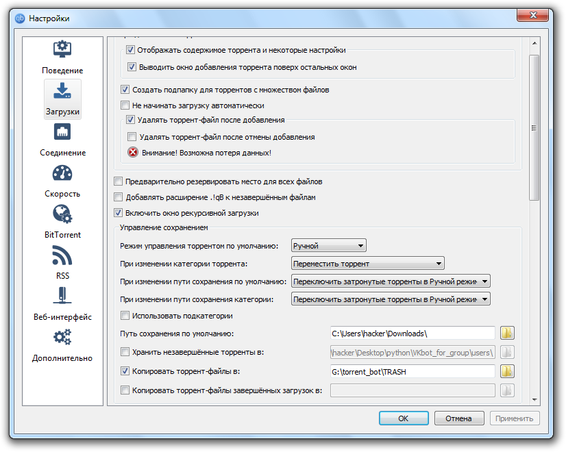
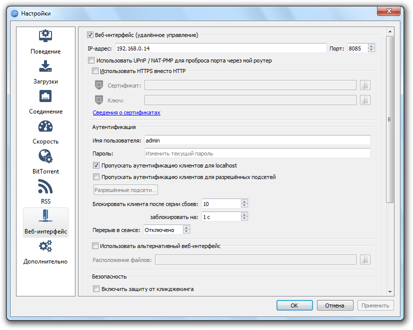
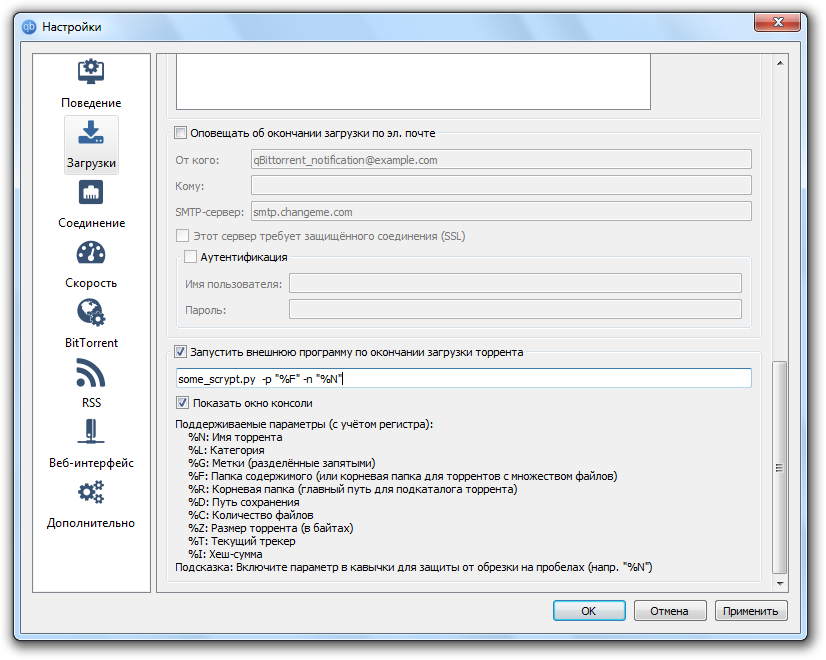

# Torrent_VK_bot
Сервис скачивания торрентов через браузер на основе vk_api

Как работает?
1. Написать группе https://vk.com/club182306529
2. Напишет, что создает папку. Она создается в папке users
3. Команда "загрузки" отобразит торренты через api
4. Постоянно требует отправить torrent - файл (отправьте ему этот файл для загрузки)
5. Этот файл скачается в torrent_user

Как настроить?
1. скачать qbittorrent
2. "Загрузки должны выглядеть так"  (копировать торрент файлы в torrent_user)

  

3. Веб-интерфейс должен быть таким (в файле конфигурации config.py можно поменять настройки под свои пароль adminadmin)

  

4. В файле конфига укажите полный путь до папки users в этом репозитории
5. Нужен пайтов и установленные зависимости
> Запускаем:

    $ pip install -r requirements.txt

6. Пишем команды боту

## Дальнейшее техническое задание

Суть: в настройках торрента можно запустить программу по завершению закачки.  
Написать дополнительный py скрипт для получения ключей из программы-клиента и манипулировать ими.

 

Как: В настройках "загрузки" клиента указать настройку запуска внешней программы

  

Программа будет принимать ключи торрента и принимать их как аргументы (см. https://jenyay.net/Programming/Argparse )

Далее она должна создать zip-архив и залить на https://vshare.is/ (api смотреть здесь https://vshare.is/docs/api ).

 

В идеале, программа должна оповестить пользователя об окончании загрузки, но это нужно сделать функцию добавления меток в vk_bot.py на 80 строке. Тогда будет легче брать id пользователя вк для отправки функцией self.send_msg() (35 строка vk_bot.py) и по окончании загрузки на vshare отправлять ссылку на скачивание. Но можно пока сделать сохранение в txt. Потом разберусь в этой вакханалии. Главное, чтобы был скелет, с чем работать.
